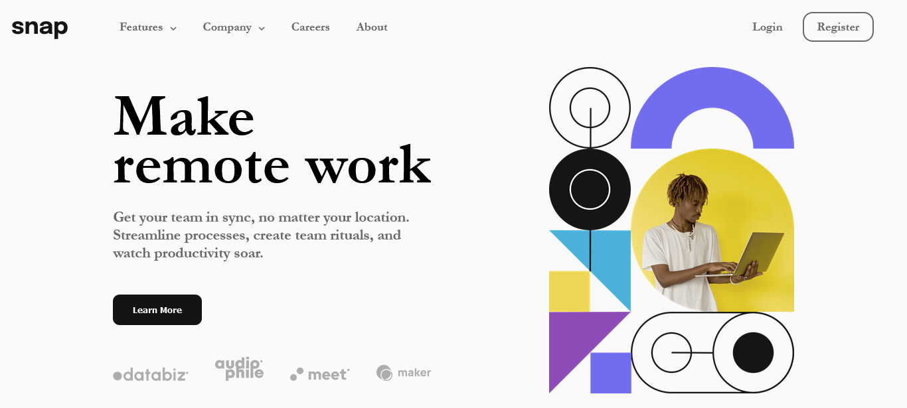
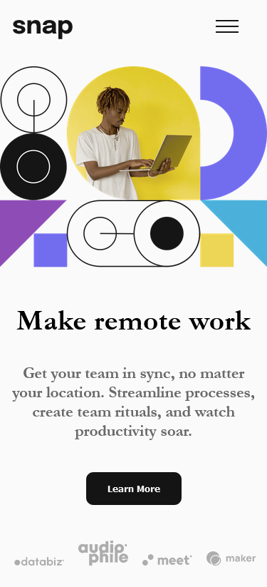
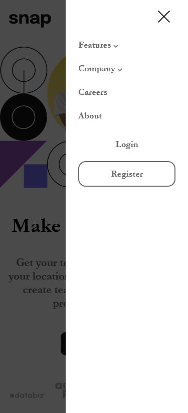

# Frontend Mentor - Intro section with dropdown navigation solution

This is a solution to the [Intro section with dropdown navigation challenge on Frontend Mentor](https://www.frontendmentor.io/challenges/intro-section-with-dropdown-navigation-ryaPetHE5). Frontend Mentor challenges help you improve your coding skills by building realistic projects.

## Table of contents

- [Overview](#overview)
  - [The challenge](#the-challenge)
  - [Screenshot](#screenshot)
  - [Links](#links)
- [My process](#my-process)
  - [Built with](#built-with)
  - [What I learned](#what-i-learned)
  - [Continued development](#continued-development)
- [Author](#author)
- [Acknowledgments](#acknowledgments)

**Note: Delete this note and update the table of contents based on what sections you keep.**

## Overview

### The challenge

Users should be able to:

- View the relevant dropdown menus on desktop and mobile when interacting with the navigation links
- View the optimal layout for the content depending on their device's screen size
- See hover states for all interactive elements on the page

### Screenshot

### Links

- Solution URL: [Snap intro github repo](https://github.com/MohammedHelal/snap-intro-section)
- Live Site URL: [Snap intro site](https://mohammedhelal.github.io/snap-intro-section/)

## My process

### Built with

- Semantic HTML5 markup
- CSS custom properties
- Flexbox
- CSS Grid
- Mobile-first workflow
- [React](https://reactjs.org/) - JS library

### What I learned

The dropdown menus gave me a bit of trouble at the beginning but the sidenav on the mobile display was the most difficult to build, I had to re-organize the code to fit it, and in the process I learned a lot about flexbox and javascript in general.

### Continued development

I will continue learning more about flexbox and modal creation.

### Useful resources

- [Web Dev Simplified Modal creation with Portal](https://www.youtube.com/watch?v=LyLa7dU5tp8&ab_channel=WebDevSimplified) - Wonderful video about modal creation it helped me alot.

## Author

- CodeSandBox - [MohammedHelal](https://codesandbox.io/u/MohammedHelal)
- Frontend Mentor - [@MohammedHelal](https://www.frontendmentor.io/profile/MohammedHelal)
